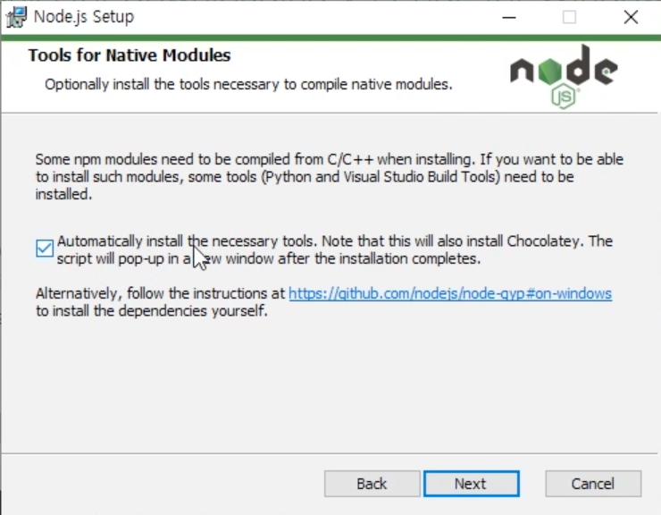
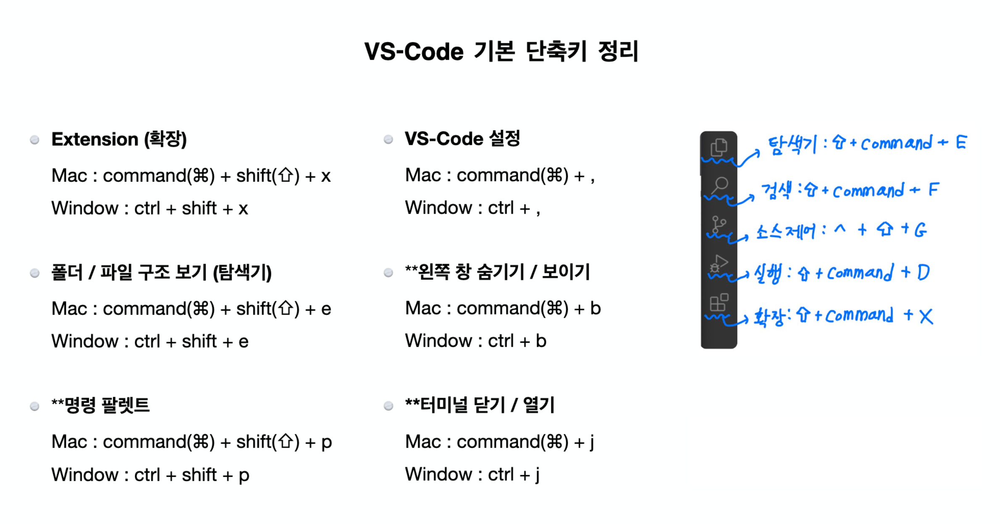
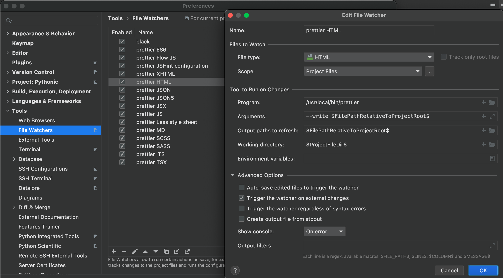
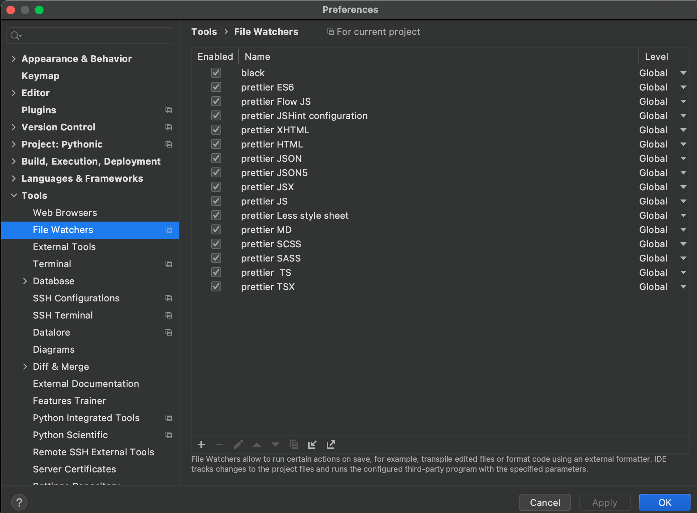

# dev settings

## docs

- [npms](https://npms.io/)
- [npmjs](https://www.npmjs.com/)

## 환경 설정 node, npm, yarn 설치

1. [node 설치](https://nodejs.org/ko/)

   - Mac OS node 업데이트

     1. `$ node -v`
     2. `$ npm cache clean -f`
        - npm 캐쉬 삭제
     3. `$ npm install -g n`
        - [n 플러그인 설치 : 노드 버전관리 플러그인](https://github.com/tj/n)
     4. `$ n stable`
        - Node.js 버전 설치
        - n latest : 최신버전
        - n lts : lts 버전
        - n stable : 안정버전

   - Window OS node 업데이트

     - [설치용 msi](https://nodejs.org/ko/download/) 다운 받아서 그냥 설치
     - 

   - npm (JS 패키지 관리자) 업데이트
     1. npm -v
     2. npm i -g npm

2. yarn 설치

   - `$ npm install --global yarn`

3. nodemon, prettier 설치

   - `$ yarn global add nodemon`
   - `$ yarn global add prettier`

## nodemon

`$ nodemon main.js` 명령어로 실시간으로 스크립트 파일을 디버깅할 수 있다.

## VSCode

## Webstorm에서 프로젝트 셋업

4. [Webstorm 설치 링크](https://www.jetbrains.com/webstorm/)

 

5. Webstorm에서 프로젝트 열기 (폴더 열기)

 

6. **prettier** 설정

   1. `which prettier`으로 prettier 패키지 경로를 체크하고 복사한다.
   2. Pycharm에서 `command + ,` (`ctrl + ,`) 단축키로 설정창 열고 `Tools` 탭에서 `File Watchers`에 들어가서 `+`버튼을 클릭한 후 `<custom>` template를 선택한다.
   3. 아래의 캡쳐 사진처럼 설정을 한다. (Program란에 복사한 prettier 패키지 경로를 설정한다.)
      - `/usr/local/bin/prettier`
      - `--write $FilePathRelativeToProjectRoot$`
      - `$FilePathRelativeToProjectRoot$`
      - `$ProjectFileDir$`

    
   
    
   

 
 

## npm & yarn 명령어 정리

|           npm 명령어            |       yarn 명령어        |                    설명                     |
| :-----------------------------: | :----------------------: | :-----------------------------------------: |
|            npm init             |        yarn init         |               프로젝트 초기화               |
|           npm install           |  yarn 또는 yarn install  |         package.json의 패키지 설치          |
|   npm install --save 패키지명   |    yarn add 패키지명     |   패키지를 프로젝트 의존성 수준으로 추가    |
| npm install --save-dev 패키지명 | yarn add --dev 패키지명  | 패키지를 프로젝트 개발 의존성 수준으로 추가 |
|  npm install --global 패키지명  | yarn global add 패키지명 |         패키지를 전역 수준으로 추가         |
|        npm update --save        |       yarn upgrade       |          프로젝트 패키지 업데이트           |
|       npm run 스크립트명        |     yarn 스크립트명      |      package.json의 스크립트 명령 실행      |
|  npm uninstall --save 패키지명  |   yarn remove 패키지명   |                 패키지 삭제                 |
|         npm cache clean         |     yarn cache clean     |                  캐쉬 삭제                  |

 

---

 

