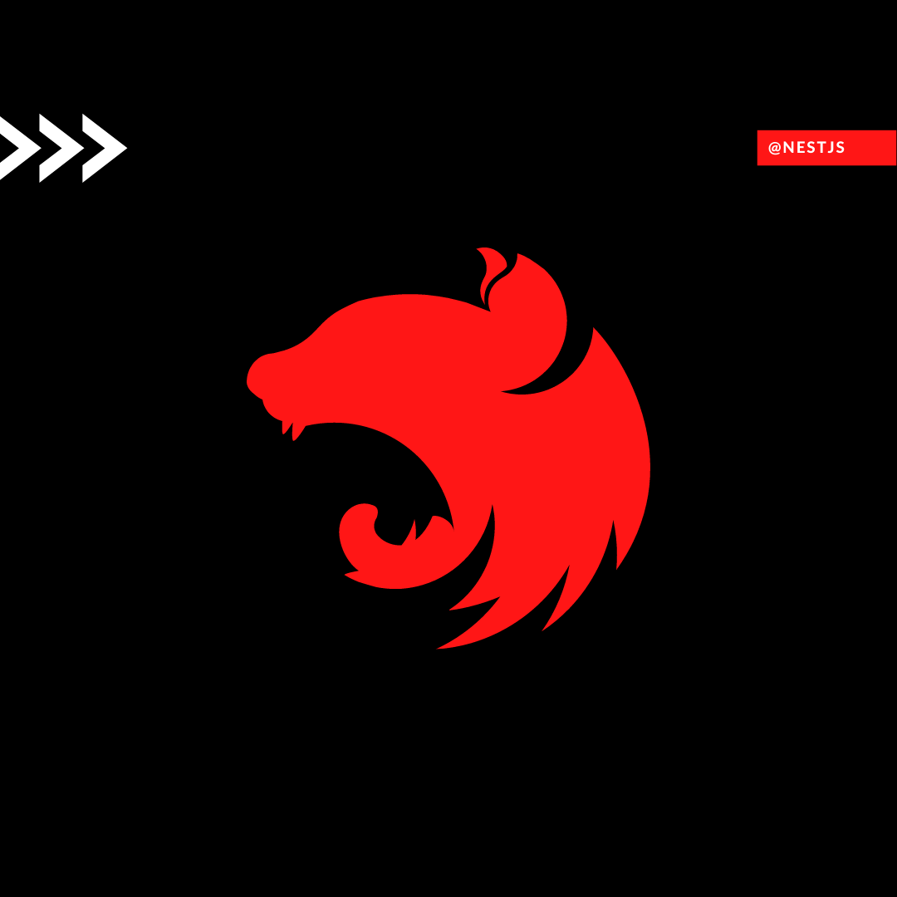

# [인프런] 탄탄한 백엔드 NestJS! 기초부터 심화까지

  <a href="https://www.inflearn.com/course/탄탄한-백엔드-네스트?inst=798f440e" target="blank"><kbd> </kbd></a>

<a href="https://www.inflearn.com/course/탄탄한-백엔드-네스트?inst=798f440e" target="_blank">강의 바로가기</a>

 

## What is NestJS?

NestJS는 TypeScript(타입스크립트)를 지원하는 효율적이고 확장 가능한 Node.js의 서버 애플리케이션 프레임워크입니다. Express 또는 Fastify와 같은 강력한 서버 프레임워크 위에 고도화된 아키텍쳐를 제공합니다. 이를 통해 애플리케이션을 마이크로서비스(Microservice)로 쉽게 분할할 수 있으며, 확장성이 높고 유지 보수가 쉬운 서버 애플리케이션을 쉽게 개발할 수 있습니다.

## Why is NestJS?

NestJS와 기존의 Node.js 프레임워크인 Express(익스프레스)의 큰 차이는 아키텍처 구조를 프레임워크에서 제공한다는 점입니다.

순수 Express를 사용하는 프로젝트에 협업을 하는 과정을 생각해 봅시다. 개발자마다 Express를 사용하는 아키텍쳐 패턴은 정말 다양합니다. 프로젝트의 규모가 커지면 커질수록 개발자 또는 팀마다 프로젝트 구조와 스타일이 다르면 협업 과정에 드는 소통 비용이 증가합니다. 이는 생산성 저하와 유지보수의 어려움으로 이어집니다

NestJS는 이런 아키텍처의 구조와 디자인 패턴을 프레임워크에서 제공합니다. 때문에 각 개발자들의 아키텍처를 통일하고 소통 비용을 절감할 수 있으며, 확장성 있고 효율적인 개발을 할 수 있습니다.

또한 기존에 Express에서 사용한 라이브러리들을 그대로 NestJS 아키텍처 위에서 사용할 수 있습니다. 뿐만 아니라, 성능 향상을 위해 Fastify를 부분별로 사용할 수도 있을 만큼의 호환성도 제공합니다.

이런 다양한 이점 덕에 많은 개발자들이 NestJS에 주목하고 있습니다.

 

## 탄탄한 백엔드 개발을 위한 NestJS의 모든 것

### 하나, NestJS를 위한 Express 코어 개념 설명

> 이렇게나 인기를 끌고 있는 NestJS가 궁금하신가요? NestJS를 알려면 Express를 먼저 배워야 한다는 말을 들어보셨을 겁니다. 기존 프레임워크보다 더 나은 프레임워크를 배우는 데 있어서 진입 장벽처럼 느껴지기 마련이죠. 이 강의에서는 NestJS를 알아보기에 앞서 NestJS를 배우기 위한 Express 강의를 제공합니다. 코어한 API를 직접 만들면서, NestJS의 아키텍처를 Express를 통해 0부터 만들어봅니다.

### 둘, 단순한 기능 위주의 강의는 Nope, 객체지향 + 디자인 패턴에 대한 이해까지

> 단순하게 NestJS의 기능에 대해서만 알려드리지 않습니다. 대신 NestJS 구조를 하나하나 설명해드리면서 객체지향 프로그래밍, 다양한 디자인 패턴도 얻어가실 수 있도록 강의를 구성했습니다.

### 셋, 공식 문서에 내용이 담긴 위치까지 알려드립니다

> 강의에서 설명하는 NestJS 관련 개념은 모두 하나하나 공식 문서를 짚어드리면서 알려드립니다. 제가 알려드린 개념에서 더 확장해 나가거나, 옵션을 추가하고 싶으실 때 강의를 따라 혼자서도 빠르게 응용할 수 있습니다.

 

## 직접 개발해 보세요! 실전 프로젝트: 고양이 정보 커뮤니티

NestJS 구조뿐만 아니라 각종 서비스에 공통적으로 존재하는 핵심 기능을 기반으로 한 “고양이 정보 커뮤니티” 실전 프로젝트 API를 클론 코딩합니다. 직접 프로젝트를 개발해 보면서 NestJS를 실제 실무에 적용할 수 있도록 도와드립니다.

